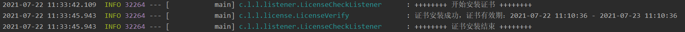
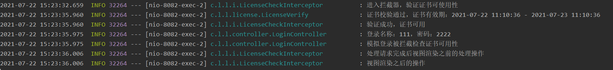

# 证书认证工具

本工具被封装为依赖jar包，用户可以将jar集成到你的springboot项目中，来实现证书的安装和认证。

本项目需要配合 [证书生成工具](https://github.com/c-onstantine/license-builder) 生成的证书和公钥库 完成对证书的安装和认证。

### 用法

以 [证书认证demo](https://github.com/c-onstantine/license-client)为例：

#### 步骤一：

在你的项目中引入本项目的jar 例如：我将license-verify-1.0.jar 放在项目的resources/jars下。那么在pom.xml中添加如下依赖（note:路径根据你自己放置位置决定)

```xml
<dependency>
    <groupId>com.liming</groupId>
    <artifactId>license-verify</artifactId>
    <version>1.0</version>
    <scope>system</scope>
    <systemPath>${project.basedir}/src/main/resources/jars/license-verify-1.0.jar</systemPath>
</dependency>
```

#### 步骤二：

在application.properties文件中添加下面三个配置

```properties
# 这三个值就是你使用证书生成工具生成证书后，将公钥记下 将证书以及公钥库放在你的项目可见的路径下。
license.storePass=公钥密码
license.licensePath=证书绝对路径
license.publicKeysStorePath=公钥库绝对路径
```

#### 步骤三：

编写监听器，监听项目启动，安装证书。监听器需要实现`ApplicationListener<ContextRefreshedEvent>`接口 并重下如下方法，并将写好的监听器加入到IOC容器中。

```java
@Override
public void onApplicationEvent(ContextRefreshedEvent event) {
    //root application context 没有parent
    ApplicationContext context = event.getApplicationContext().getParent();
    if(context == null){
        if(!StringUtils.isEmpty(licensePath)){
            log.info("++++++++ 开始安装证书 ++++++++");

            LicenseVerifyParam param = new LicenseVerifyParam();
            param.setSubject(subject);
            param.setPublicAlias(publicAlias);
            param.setStorePass(storePass);
            param.setLicensePath(licensePath);
            param.setPublicKeysStorePath(publicKeysStorePath);

            LicenseVerify licenseVerify = new LicenseVerify();
            //安装证书
            licenseVerify.install(param);

            log.info("++++++++ 证书安装结束 ++++++++");
        }
    }
}
```

#### 步骤四：

创建拦截器，将想要证书认证的请求进行拦截，实现证书认证。核心方法：

```java

@Override
public boolean preHandle(HttpServletRequest request, HttpServletResponse response, Object handler) throws Exception {
    log.info("进入拦截器，验证证书可使用性");
    LicenseVerify licenseVerify = new LicenseVerify();

    //校验证书是否有效
    boolean verifyResult = licenseVerify.verify();

    if(verifyResult){
        log.info("验证成功，证书可用");
        return true;
    }else{
        log.info("验证失败，证书无效");
        response.setCharacterEncoding("utf-8");
        Map<String,String> result = new HashMap<>(1);
        result.put("result","您的证书无效，请核查服务器是否取得授权或重新申请证书！");
        response.getWriter().write(JSON.toJSONString(result));
        return false;
    }
}
```

配置拦截路径：

```java
    @Autowired
    private LicenseCheckInterceptor licenseCheckInterceptor;

    @Override
    public void addInterceptors(InterceptorRegistry registry) {

        //添加要拦截的url
        registry.addInterceptor(licenseCheckInterceptor)
                // 拦截的路径
                .addPathPatterns("/**");
                // 放行的路径
//                .excludePathPatterns("/admin/login");
    }
```

#### 步骤五：

访问接口测试证书验证是否成功。






具体可以参考  [证书认证demo](https://github.com/c-onstantine/license-client) 来实现，这里仅提供了拦截器的方式，你也可以配置过滤器 或者AOP 进行拦截 只需要参考证书认证方法实现即可。

